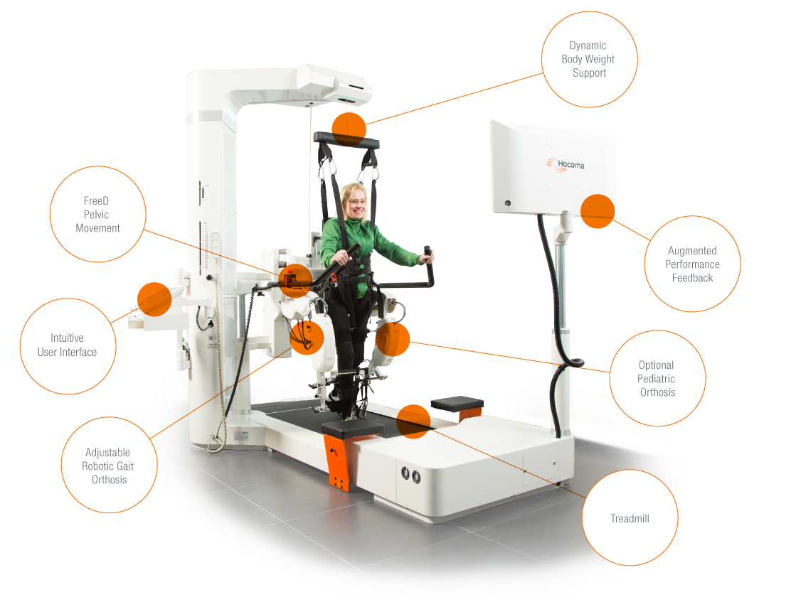

# PROJETOLOKOMAT
Repositório para o Lokomat, dispositivo que auxilia na reabilitação de pacientes com dificuldades de mobilidade. Consiste em um exoesqueleto e esteira rolante, proporcionando terapia de movimento guiado e repetitivo para melhorar a função das pernas.

Lokomat

